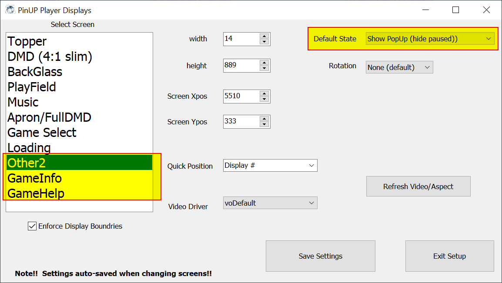
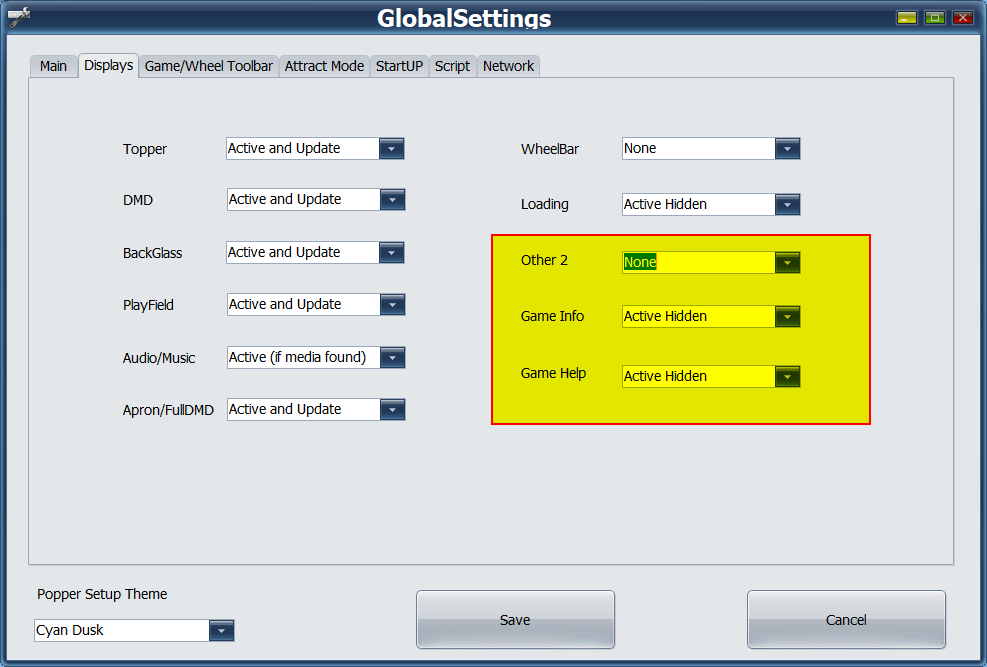
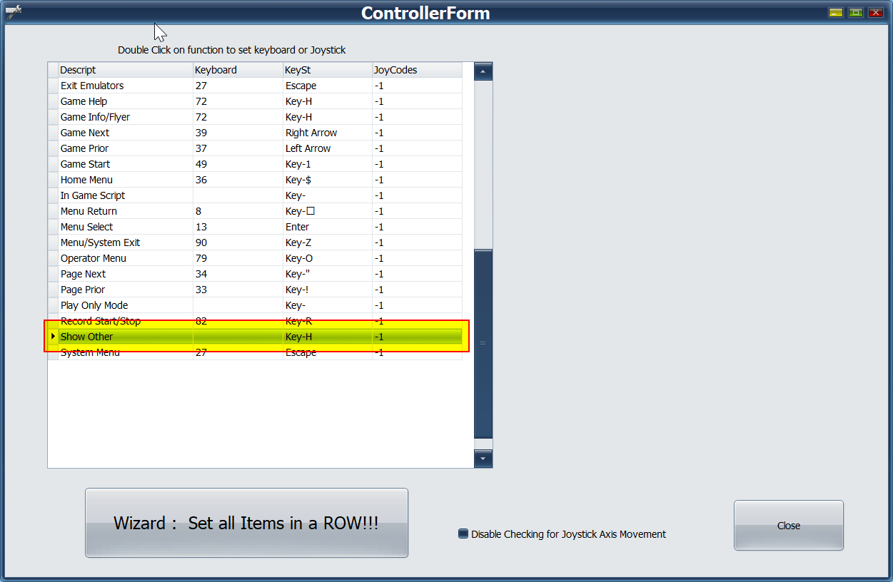
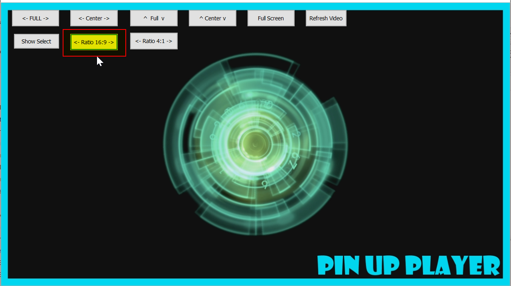

# VPin Extensions

VPin Extensions provides an easy generation of highscore cards for Visual Pinball tables running with VPX 
and PinUP Popper. A user interface allows you customize the size, color, fonts and design of highscore cards,
which are generated everytime a highscore changes.

*Configuration screen for highscore card generation.*

*Sample generated with the highscore card generator.*

*Sample generated with the highscore card generator.*

Additionally, the service runner provides the generation of a global highscore card which includes multiple tables.
This overlay can be opend via configurable shortcut every time using PinUP popper or playing a table.

#Overview 
###[Installation](#installation)

## Installation

Check https://github.com/syd711/vpin-extensions/releases for latest releases 
and download the __VPinExtensions.zip__ file there.

Copy the file next to your PinUP Popper (Baller) installation like shown below and extract the zip file there.

In the extracted __VPinExtensions__ folder, execute the __install.bat__ file via double-click.

Once the installation is completed (including a JDK download), the folder should look like this:

## Configure Highscore Overlay

## Configure Highscore Cards 

## Configure DOF Rules

The usual modifier keys are numeric here:

Strg/Ctrl-Left: 2
Strg/Ctrl-Right: 32

Shift-Left: 1
Shift-Right: 16

Alt-Left: 8

E.g. for Ctrl+C => 2+c
