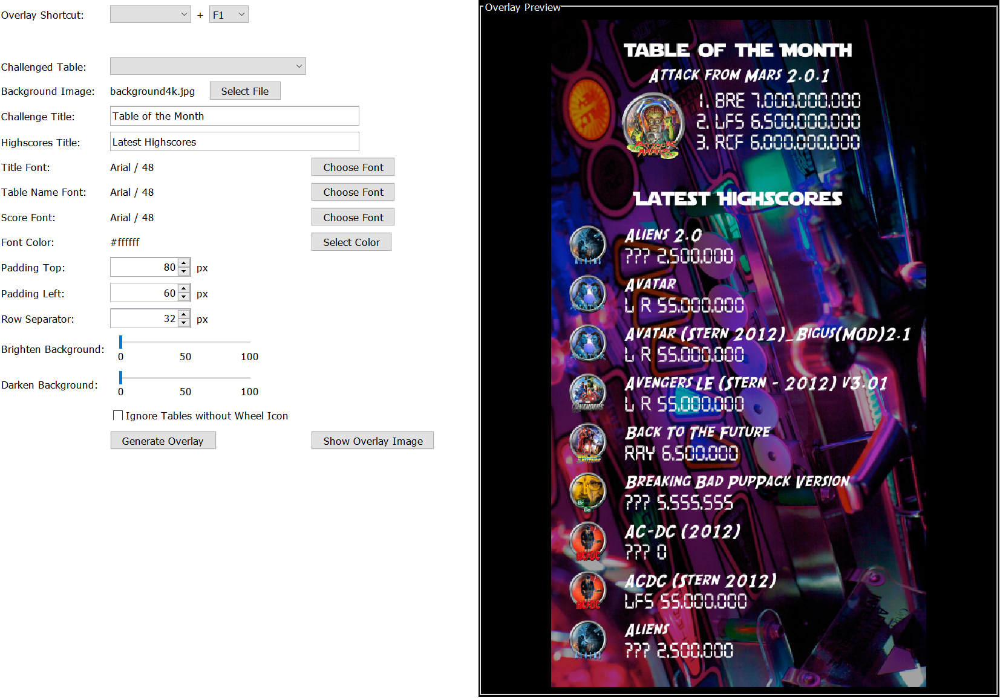

# VPin Extensions

VPin Extensions provides an easy generation of highscore cards for Visual Pinball tables running with VPX 
and PinUP Popper. A user interface allows you customize the size, color, fonts and design of highscore cards,
which are generated everytime a highscore changes.

* Overview
* Installation
* Configure Highscore Overlay
* Configure Highscore Cards
* Configure DOF Rules
* Table Overview

## Overview

This section gives a brief overview about the functionality provided by this project.

*Configuration screen for highscore card generation.*

*Samples generated with the highscore card generator.*

Additionally, the service runner provides the generation of a global highscore card which includes multiple tables.
This overlay can be opend via configurable shortcut.

*Configuration screen for overlay screen generation.*

The __DOF Event Rules__ sections allows to trigger DOF commands based on events emitted by the 
system or PinUP Popper:

*Configuration screen for DOF rules.*

The __Table Overview__ gives an overview about all tables installed in PinUP Popper
and their VPin Extensions support status.

*Configuration screen for the table overview.*

## Installation

Check https://github.com/syd711/vpin-extensions/releases for latest releases 
and download the __VPinExtensions.zip__ file there.

Copy the file next to your PinUP Popper (Baller) installation like shown below and extract the zip file there.

In the extracted __VPinExtensions__ folder, execute the __install.bat__ file via double-click.

Once the installation is completed (including a JDK download), the folder should look like this:

## Configure Highscore Overlay

## Configure Highscore Cards

The highscore card generation is enabled once a PinUP Popper screen has been selected.
Currently, the screens __Other2__, __GameInfo__ and __GameHelp__ are supported.
Be aware that if the __VPin Extensions Service__ is started, existing media in the
corresponding PinUP Popper folder will be overwritten. An additional warning of this is visible in the UI for this.

If no screen is selected, not highscore card is generation is disabled.

For testing the generator output, a sample table can be selected and the button
__Generate Sample Card__ will generate a sample highscore image and preview it in the right panel of the editor.

Be careful when selecting __another background image__. The selected image is not scaled or cropped in any form.
It's recommend to select a matching size with a fix ratio of __16:9__ or __4:1__, because these are the 
ratios supported by the PinUP popper screen configuration.

### Screen Setup in PinUP Popper

There is already a good documentation for this available at https://www.nailbuster.com/wikipinup/doku.php.
The basic steps to show the generated highscore cards are explained here again nonetheless.
The given screenshots are showing the setup where highscore cards are shown on the __Other 2__ screen.

__Make sure that the screen is active in the global settings:__

__Also check that the screen is visible in the screen settings...__

__...and that the screen ratio matches the one selected for the card background image.__

__In the controller section, make sure that you have a shortcut defined for showing the highscore card.__

If everything is configured properly, you can press the configured control for the "Show Other 2" screen
and the generated highscore card should pop up (if already been generated!).

## Configure DOF Rules

## Table Overview

The __Table Overview__ gives you an overview of the tables configured for PinUP popper.
It also shows the current state for the highscore resolving.

E.g. if a ROM name was not found, an error indicator is shown with a corresponding message.
_The name if the table's ROM is required to resolve the highscore file of the table
and must be present._ 

Another valid message is that no highscore was found. This isn't necessarily a problem
when a table has not been played yet.

If a table shows no configuration errors, you click on the __Show Highscore__ button
to see the current highscores of the selected table.

