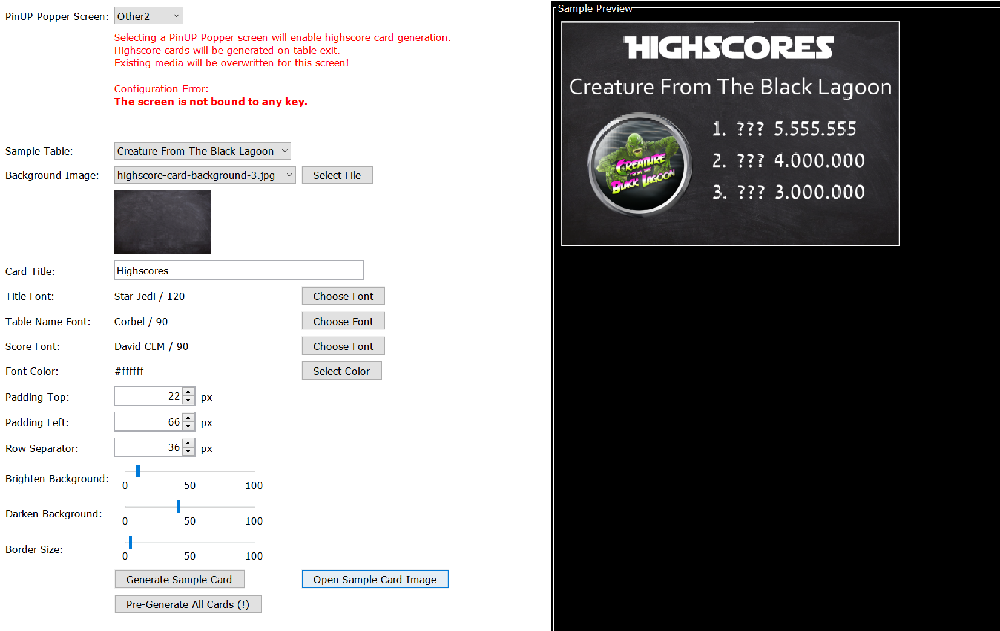
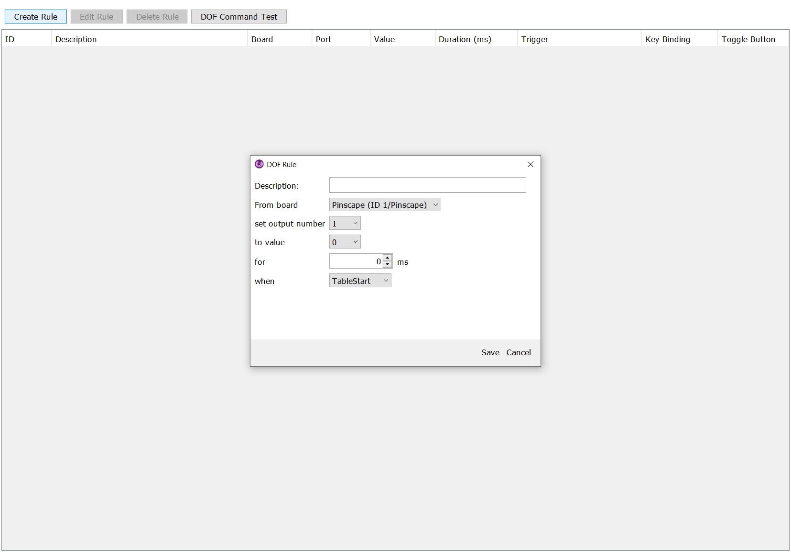
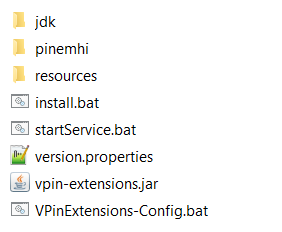
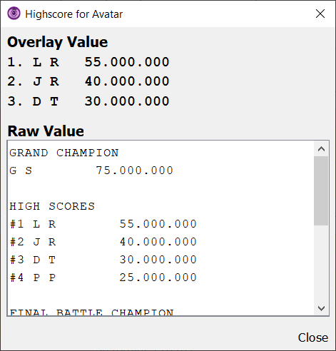

# VPin Extensions

VPin Extensions provides an easy generation of highscore cards for Visual Pinball tables running with VPX 
and PinUP Popper. The user interface allows customize the size, color, fonts and design of highscore cards,
which are generated everytime a table highscore changes.

* [Overview](#overview)
* [Installation](#installation)
* [Configure Highscore Overlay](#configure-highscore-overlay)
* [Configure Highscore Cards](#configure-highscore-cards)
* [Configure DOF Rules](#configure-dof-rules)
* [Table Overview](#table-overview)
* [Service Status](#service-status)
* [Trouble Shooting](#trouble-shooting)

## Overview

This section gives a brief overview about the functionality provided by this project.

*Configuration screen for highscore card generation.*

*Samples generated with the highscore card generator.*

Additionally, the service instance provides the generation of a global highscore card which includes multiple tables.
This overlay can be opend with a configurable shortcut while playing.

*Configuration screen for overlay screen generation.*

The __DOF Event Rules__ sections allows to trigger DOF commands based on events emitted by the 
system or PinUP Popper:

*Configuration screen for DOF rules.*

The __Table Overview__ gives an overview about all tables installed in PinUP Popper
and their VPin Extensions support status.

## Installation

Check https://github.com/syd711/vpin-extensions/releases for latest releases 
and download the __VPinExtensions.zip__ file there.

Copy the file next to your PinUP Popper (Baller) installation like shown below and extract the zip file there.

In the extracted __VPinExtensions__ folder, execute the __install.bat__ file via double-click.

Once the installation is completed (including a JDK download), the folder should look like this:

That was the hard part. Now you can execute the __VPinExtensions-Config.bat__ file.
You will be greeted with the following dialog:

You should execute the table scan. The scan determines the ROM name for every table available
so that the highscore file can be derived from it.

## Configure Highscore Overlay

The __Highscore Overlay__ tab allows to configure a shortcut and generation of a
full screen highscore overview which shows the recently played tables and an optional special table
(e.g. for a monthly challange). The user interface provides different configuration
options for the overlay generation. The overlay is generated after every table exit, so
that the recently played table list is always up-to-date.

When you want to customize the overlay, __ensure that the background image dimensions
match the resolution of the playfield screen__. The highscore information are generated
on this image - no additional scaling or cropping is done.

*Overlay Shotcut Configuration*

Once the VPin-Extension service is running, the configured key binding is valid until
the service is restarted. __Be aware that once the service is running the key binding is active, 
no matter if PinUP Popper is running or not!__

## Configure Highscore Cards

The highscore card generation is enabled once a PinUP Popper screen has been selected.
Currently, the screens __Other2__, __GameInfo__ and __GameHelp__ are supported.
Be aware that if the __VPin Extensions Service__ is started, existing media in the
corresponding PinUP Popper folder will be overwritten. 
An additional warning is also shown by the UI for this:

You may get the additional warning that the screen is not bound to any key.
Check the controller settings in PinUP Popper for this screen so that you can hide it if you want.

If no screen is selected, the highscore card is generation is disabled.

For testing the generator output, a sample table can be selected and clicking the 
__Generate Sample Card__ button will generate a sample highscore image and preview 
it in the right panel next to the editor.

Be careful when selecting __another background image__. The selected image is not scaled or cropped in any form.
It's recommend to select a matching size with a fix ratio of __16:9__ or __4:1__, because these are the 
ratios supported by the PinUP popper screen configuration.

### Screen Setup in PinUP Popper

*(TODO - maybe errorneous)*

There is already a good documentation for this available at https://www.nailbuster.com/wikipinup/doku.php.
The basic steps to show the generated highscore cards are explained here again nonetheless.
The given screenshots are showing the setup where highscore cards are shown on the __Other 2__ screen
and the screen is shown when the configured controller key is pressed.

__Make sure that the screen is active in the pub pack:__

__Also check that the screen is visible in the screen settings...__

__...and that the screen ratio matches the one selected for the card background image.__

__In the controller section, make sure that you have a shortcut defined for showing the highscore card.__

If everything is configured properly, you can press the configured control for the __Other 2__ screen
and the generated highscore card should pop up (if already been generated!).

*Note that all tables will have a highscore card. So you may want to delete the default media stored
for the screen you selected. 
The emulator defaults are stored in __pinupsystem\POPMEDIA\<EACH EMULTAOR>\SYTEM__. 
You can change or remove the screen's default media there (remember you need to do this for each emulator in system).*

See also https://www.nailbuster.com/wikipinup/doku.php?id=faq

## Configure DOF Rules

__Experimental (not tested yet, board resolving may be broken)__

The DOF rules allow you to react on specific system and PinUP Popper events.
They can be used to trigger toys when a table is started or exited.

Every rule starts with a description and has additional attributes defining
which pin should be triggered when and/or for how long.

## Table Overview

The __Table Overview__ gives you an overview of the tables configured for PinUP popper.
It also shows the current state for the highscore resolving.

E.g. if a ROM name was not found, an error indicator is shown with a corresponding message.
__The name if the table's ROM is required to resolve the highscore file of the table
and must be present.__ 

It is also possible that no highscore file was found for a table. This isn't necessarily a problem
when a table has not been played yet. 

If a table shows no configuration errors, a click on the __Show Highscore__ button
shows the current highscores of the selected table.

## Service Status

The service status tab gives an overview about the the installation status of the VPin Extensions service.
You can (and should) press the __Install Service__ button there to ensure that the service is running
everytime your VPin is booted.

Additionally, a __Test Service__ can be started. This service is alive as long as the configuration
window stays open. Once started, you can use test the shortcut defined for the overlay or your DOF rules.

As an alternative, the __startService.bat__ script can be executed to start a temporary service instance. 

## Trouble Shooting

### I got the following error during startup!

The paths for __PinUPPopper__ and the __VisualPinball__ are tried to re resolved automatically.
However, older PinUP System installations may be located on a different device.
To fix this problem, ensure that the path information written into the file __./resources/env.properties__ are correct.

*(Do not mind the escaped ':' character, the will work no matter if the ':' is escaped or not. Also use '/' instead of '\\'.)*

### I got encoding problems on my highscore cards!

Users have reported whitespace problems for their generated highscore cards.
You can change this by settings a comma as number separator in your windows settings.
See also: https://forums.gameex.com/forums/topic/26335-scores-files-text-from-pinemhi-contains-strange-characters-as-thousands-separator/

## See Also
[Used Third-Party Libraries](./documentation/third-party-licenses/licenses.xml)

For license texts have a look at [Third-Party Libraries](./documentation/third-party-licenses/)

